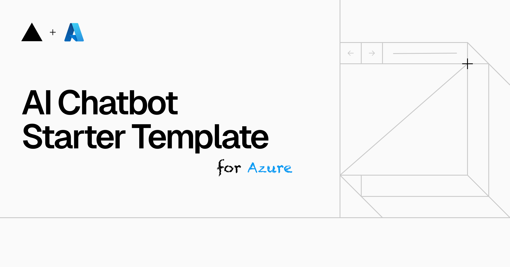

<a href="https://chat.vercel.ai/">
  
  <h1 align="center">Next.js AI Chatbot for Azure</h1>
</a>

<p align="center">
  A fork of <a href="https://github.com/vercel/ai-chatbot" target="_blank">An Open-Source AI Chatbot Template</a>. Everything is the same, but repurposed for Azure.
</p>

<p align="center">
  <a href="#features"><strong>Features</strong></a> ·
  <a href="#model-providers"><strong>Model Providers</strong></a> ·
  <a href="#deploy-your-own"><strong>Deploy Your Own</strong></a> ·
  <a href="#running-locally"><strong>Running locally</strong></a>
</p>
<br/>

## Features

- [Next.js](https://nextjs.org) App Router
  - Advanced routing for seamless navigation and performance
  - React Server Components (RSCs) and Server Actions for server-side rendering and increased performance
- [AI SDK](https://sdk.vercel.ai/docs)
  - Unified API for generating text, structured objects, and tool calls with LLMs
  - Hooks for building dynamic chat and generative user interfaces
  - Supports OpenAI (default), Anthropic, Cohere, and other model providers
- [shadcn/ui](https://ui.shadcn.com)
  - Styling with [Tailwind CSS](https://tailwindcss.com)
  - Component primitives from [Radix UI](https://radix-ui.com) for accessibility and flexibility
- Data Persistence
  - [Azure CosmosDB for PostgreSQL](https://learn.microsoft.com/en-us/azure/cosmos-db/postgresql/) for saving chat history and user data
  - [Azure Blob Storage](https://learn.microsoft.com/en-us/azure/storage/common/storage-introduction) for efficient file storage
- [NextAuth.js](https://github.com/nextauthjs/next-auth)
  - Simple and secure authentication

## Model Providers

This template comes with three default Azure OpenAI model configurations through environment variables: a small model (e.g., `o3-mini`), a large model (e.g., `o1`), and a reasoning model (e.g., DeepSeek). Using the [AI SDK](https://sdk.vercel.ai/docs) with [AzureProvider](https://sdk.vercel.ai/providers/ai-sdk-providers/azure), you can easily configure additional models and LLM providers with just a few environment variable updates, see `.env.example` for guidance.

## Deploy Your Own

You can deploy your own version of the Next.js AI Chatbot either directly or containerized to a [Azure App Service](https://learn.microsoft.com/en-us/azure/app-service/overview).

`Dockerfile` template is taken from [Next.js example repo](https://github.com/vercel/next.js/tree/canary/examples/with-docker) with a slight modification of updating image to [`node:21-alpine`](https://hub.docker.com/layers/library/node/21-alpine/images/sha256-7364f864dab534a6e982e683813e2a6b1b3cbe86217225dce31aedb75a4c96a3?context=explore)

## Running locally

You will need to use the environment variables [defined in `.env.example`](.env.example) to run Next.js AI Chatbot.

> Note: You should not commit your `.env` file or it will expose secrets that will allow others to control access to your various OpenAI and authentication provider accounts.

1. Deploy three LLM models on [Azure AI Foundry](https://ai.azure.com)
2. Deploy Azure CosmosDB for PostgreSQL
3. Create Azure Blob Storage
4. Create `.env.local`, copy over, and fill in all the environment variables from `.env.example`

```bash
pnpm install
pnpm dev
```

Your app template should now be running on [localhost:3000](http://localhost:3000/).

### Running with Docker

1. Build your container: `docker build -t nextjs-docker .`.
2. Run your container: `docker run -p 3000:3000 nextjs-docker`.

## Additional instructions for Azure CosmosDB for Postgres

If you are getting permission denied error, you can first grant create permission to particular user with that database.

```bash
GRANT CREATE ON DATABASE citus to citus;
```

NOTE: PG15 introduced the concept of security invoker and security definer views. All views pre-PG15 are security definer views. However Citus treats all views as security invoker views.
